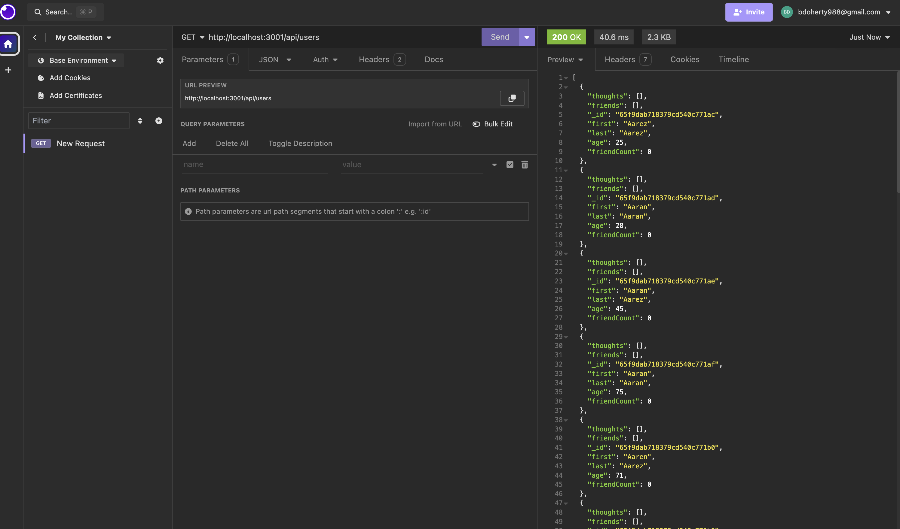
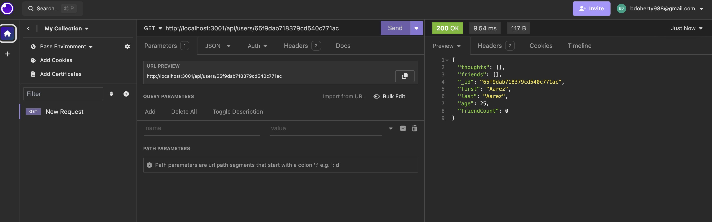
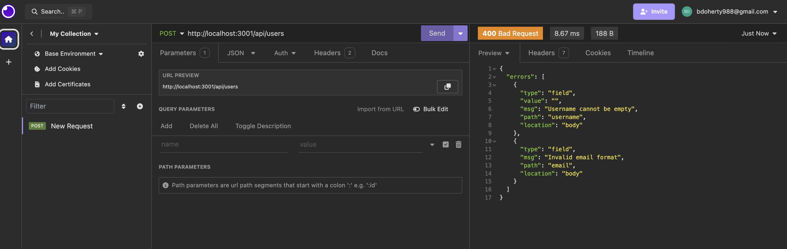
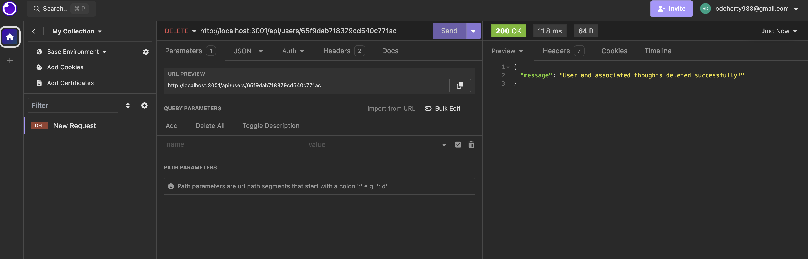

# SocialApp
# Social Network API

This is a RESTful API for a social network web application where users can share their thoughts, react to friends' thoughts, and create a friend list. The API is built using Express.js for routing, MongoDB for the database, and Mongoose as the ODM.

## Screenshots

<!-- Placeholder for screenshots -->

## Getting Started

To get started with this API, follow these steps:

1. Clone this repository.
2. Install dependencies using `npm install`.
3. Set up environment variables by creating a `.env` file and specifying `PORT` and `MONGODB_URI`.
4. Seed the database with sample data using `npm run seed`.
5. Start the server using `npm start`.

## Features

- User authentication and authorization
- CRUD operations for users, thoughts, and reactions
- Friend list management
- Error handling and validation

## Usage

You can test the API endpoints using tools like Postman or Insomnia. Here are the available routes:

- `/api/users`: CRUD operations for users
- `/api/thoughts`: CRUD operations for thoughts
- `/api/thoughts/:thoughtId/reactions`: CRUD operations for reactions to thoughts
- `/api/users/:userId/friends/:friendId`: Add or remove friends for a user

## Walkthrough Video

## Technologies Used

- Express.js
- MongoDB
- Mongoose
- Node.js

## Contributors

- [Brian Doherty](link-to-github)